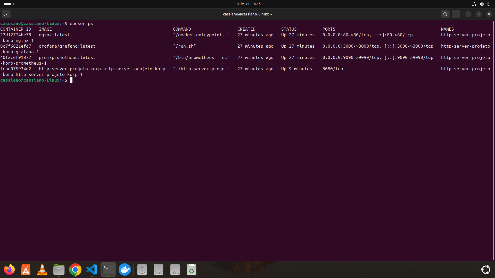
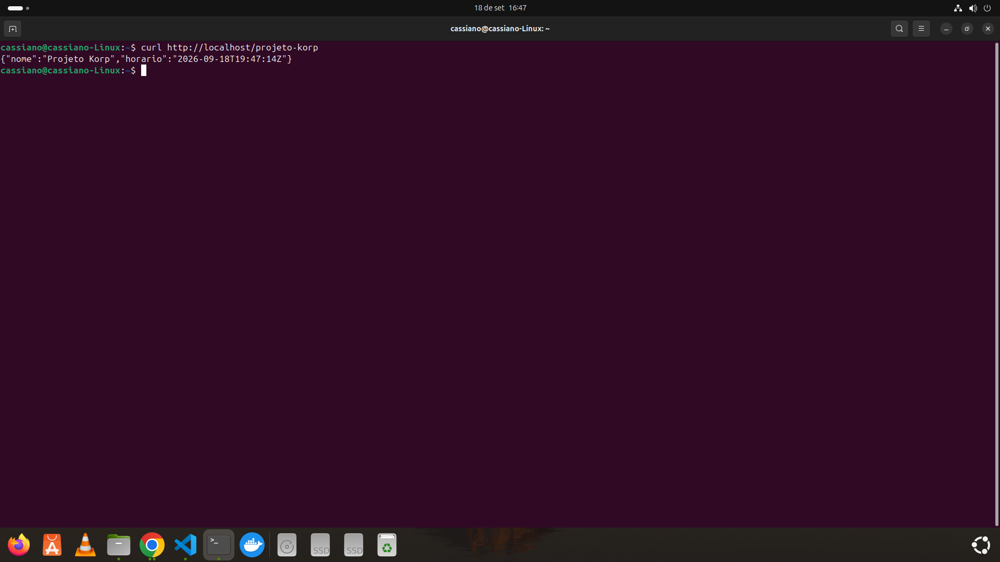
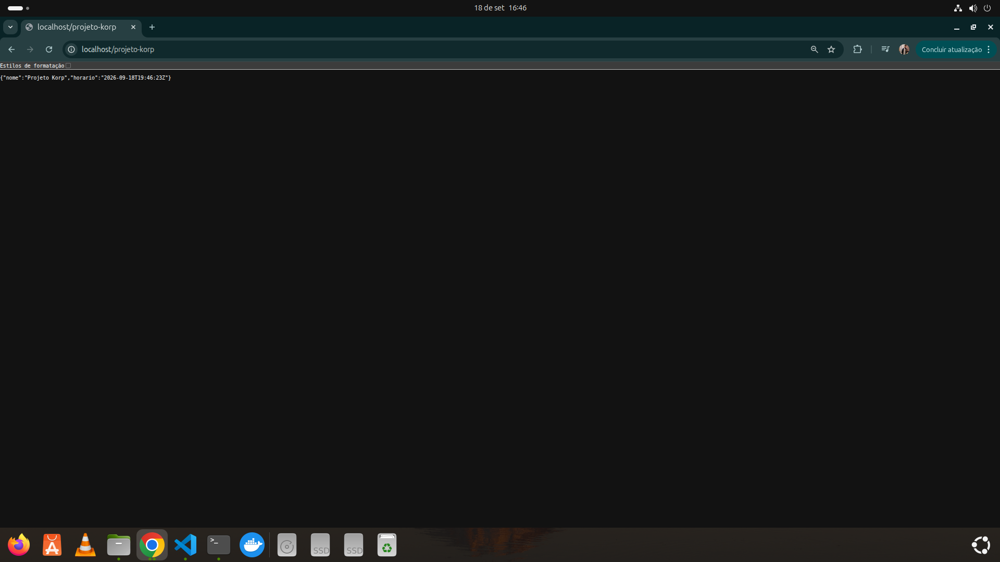
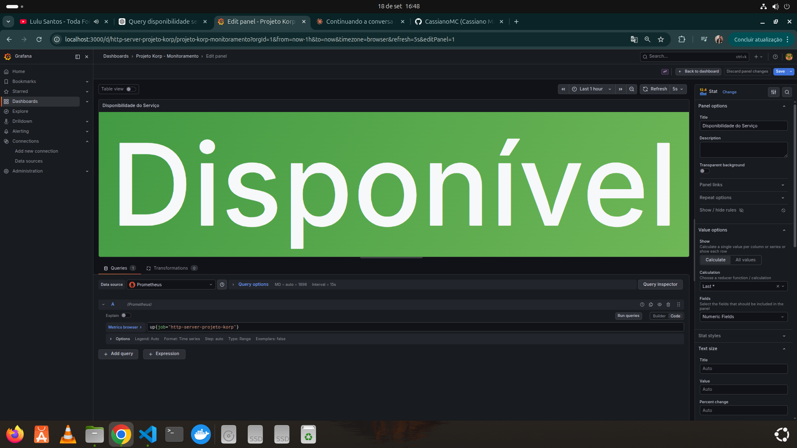
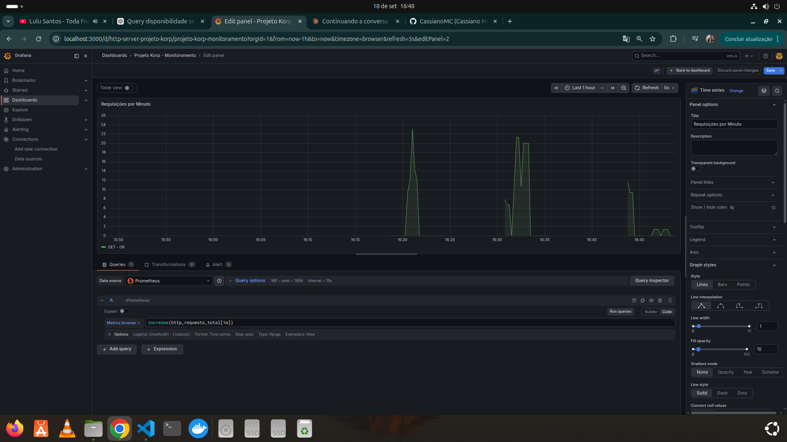
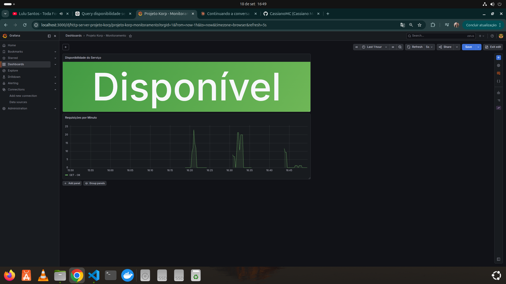
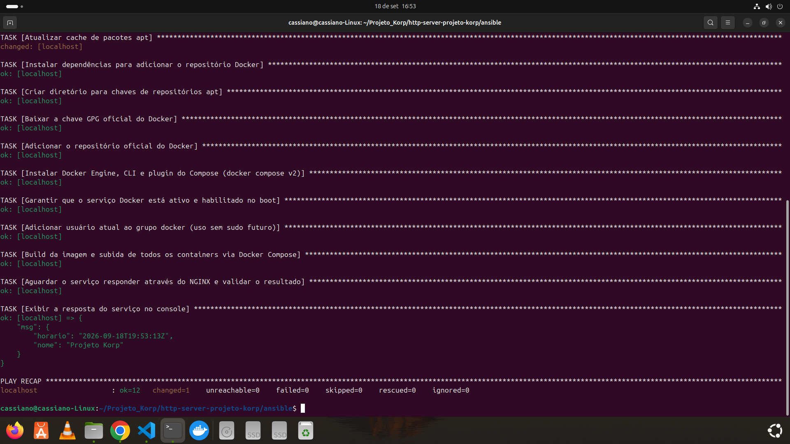

# http-server-projeto-korp

Projeto desenvolvido para o desafio tecnico da Korp: um servico HTTP em Go, containerizado com Docker, exposto por um proxy reverso Nginx, monitorado com Prometheus e Grafana, e provisionado por Ansible.

## Visao geral

A aplicacao expoe o endpoint `GET /projeto-korp`, que retorna um JSON com o nome do projeto e o horario atual em UTC. O ambiente completo roda com Docker Compose e inclui:

- Aplicacao Go na porta interna `8080`
- Nginx recebendo requisicoes na porta `80`
- Prometheus coletando metricas na porta `9090`
- Grafana exibindo dashboard na porta `3000`
- Ansible automatizando instalacao do Docker, build e subida dos containers

## Arquitetura

Fluxo principal:

```text
Cliente
  |
  | GET http://localhost/projeto-korp
  v
Nginx :80
  |
  | proxy_pass
  v
Aplicacao Go :8080
  |
  | /metrics
  v
Prometheus :9090
  |
  v
Grafana :3000
```

## Tecnologias

- Go `1.25.0`
- Docker e Docker Compose
- Nginx
- Prometheus
- Grafana
- Ansible

## Estrutura do projeto

```text
.
├── README.md
├── Documentação/
│   └── prints/
│       ├── 01-docker-compose-ps.png
│       ├── 02-curl-endpoint.png
│       ├── 03-endpoint-navegador.png
│       ├── 04-grafana-query-disponibilidade.png
│       ├── 05-grafana-query-requisicoes.png
│       ├── 06-grafana-dashboard-disponivel.png
│       ├── 07-grafana-dashboard-indisponivel.png
│       └── 08-ansible-playbook-validacao.png
└── http-server-projeto-korp/
    ├── app/
    │   ├── Dockerfile
    │   ├── go.mod
    │   ├── go.sum
    │   └── main.go
    ├── ansible/
    │   ├── inventory.ini
    │   ├── playbook.yml
    │   └── requirements.yml
    ├── grafana/
    │   ├── dashboards-json/
    │   └── provisioning/
    ├── nginx/
    │   └── http-server-projeto-korp.conf
    ├── prometheus/
    │   └── prometheus.yml
    └── docker-compose.yml
```

## Como executar com Docker Compose

Entre na pasta do ambiente:

```bash
cd http-server-projeto-korp
```

Suba todos os servicos:

```bash
docker compose up --build -d
```

Verifique os containers:

```bash
docker compose ps
```

Teste o endpoint pela porta publica do Nginx:

```bash
curl http://localhost/projeto-korp
```

Resposta esperada:

```json
{
  "nome": "Projeto Korp",
  "horario": "2026-09-18T19:00:00Z"
}
```

## Endpoints

| Servico | URL | Descricao |
|---|---|---|
| Aplicacao via Nginx | `http://localhost/projeto-korp` | Retorna o JSON principal do desafio |
| Metricas da aplicacao | `http://localhost/metrics` | Exibe metricas Prometheus via Nginx |
| Prometheus | `http://localhost:9090` | Interface para consultas PromQL |
| Grafana | `http://localhost:3000` | Dashboard de monitoramento |

## Metricas

A aplicacao registra a metrica customizada:

```text
http_requests_total{method="GET",status="OK"}
```

Ela contabiliza requisicoes recebidas pelo endpoint `/projeto-korp`, separando por metodo HTTP e status textual.

O Prometheus coleta as metricas do container da aplicacao usando o nome do servico Docker:

```yaml
targets: ["http-server-projeto-korp:8080"]
```

## Dashboard Grafana

O Grafana e provisionado automaticamente com:

- Datasource Prometheus
- Dashboard `Projeto Korp - Monitoramento`
- Painel `Disponibilidade do Serviço`
- Painel `Requisições por Minuto`

Depois de subir o ambiente, acesse:

```text
http://localhost:3000
```

Login padrao do Grafana:

```text
usuario: admin
senha: admin
```

Na primeira entrada, o Grafana pode pedir a troca de senha.

## Automacao com Ansible

O playbook em `http-server-projeto-korp/ansible/playbook.yml` automatiza:

- Atualizacao do cache `apt`
- Instalacao de dependencias para o repositorio Docker
- Configuracao da chave GPG e repositorio oficial Docker
- Instalacao do Docker Engine, CLI e plugin Compose
- Inicializacao e habilitacao do servico Docker
- Inclusao do usuario no grupo `docker`
- Build e subida do ambiente via Docker Compose
- Validacao do endpoint `http://localhost/projeto-korp`

Para executar:

```bash
cd http-server-projeto-korp/ansible
ansible-galaxy collection install -r requirements.yml
ansible-playbook -i inventory.ini playbook.yml --ask-become-pass
```

## Evidencias de execucao

Os prints abaixo documentam a execucao do projeto de ponta a ponta.

### Containers ativos



### Endpoint respondendo no terminal



### Endpoint respondendo no navegador



### Queries dos paineis no Grafana





### Dashboard Grafana



### Validacao com Ansible



## Status do desafio

- [x] Servico HTTP em Go
- [x] Endpoint `/projeto-korp` com JSON dinamico em UTC
- [x] Dockerfile da aplicacao
- [x] Docker Compose com rede bridge
- [x] Proxy reverso com Nginx
- [x] Metricas Prometheus
- [x] Dashboard Grafana provisionado
- [x] Automacao com Ansible
